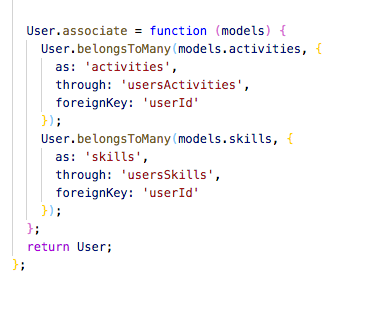
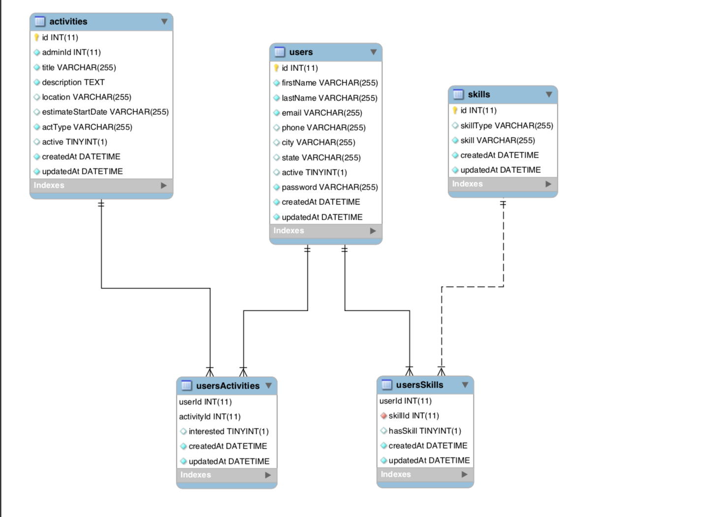
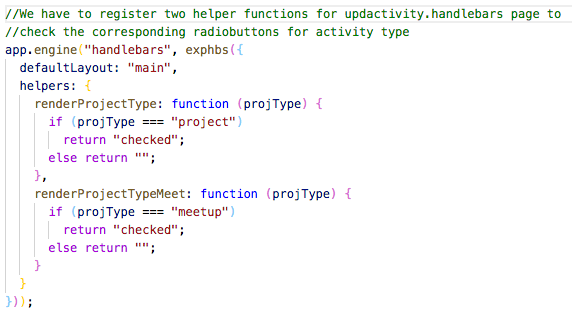
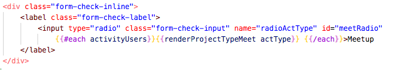
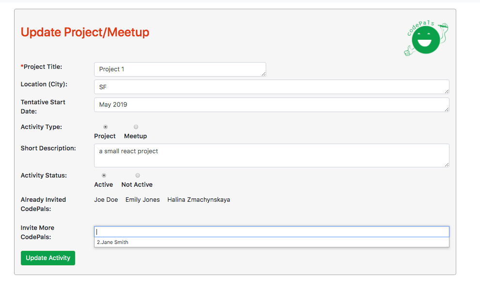

# codePals
## <a name="introduction"> Introduction </a>
<hr />
Fullstack Appplication Node server Express &amp; mysql. 
This application will help coonnect people with want to come together to create a usable software , endless possibilties to create an amazing network of people around. 

This app is one spot hub to share information related to tech meetups for codePlas to broswer through the events and slect if they are interested or not. 

-- Screenshot of the App Page  

## Table of Content
+ [Introduction](#introduction)
+ [Getting Started](#gettingstarted)
+ [Technologies Used](#builtWith)
+ [App Features](#features)
+ [DB Architecture](#dbarchiterture)
+ [DB EER Diagram](#errDB)
+ [Using bulkCreate](#bulkcreate)
+ [Authentication](#authentication)
+ [Using Handlebars Helper Functions](#helpers)
+ [Update Activity Form](#updactivity)
+ [CRU Profile & Skills](#updProfile)
+ [View Pals](#viewallpals)

## <a name="gettingstarted"> Getting Started </a>
<hr/>
These instructions will get you a copy of the project up and running on your local machine for development and testing purposes.

## Prerequisites

What things you need installed before running this application.

+ [Node](https://nodejs.org/en/download/)
+ [npm](https://docs.npmjs.com/cli/install)
+ [MySQL](https://dev.mysql.com/downloads/windows/installer/8.0.html)

```
    npm install 

    install dependencies that are located in package.json

    "dependencies": {
        "bcryptjs": "^2.4.3",
        "body-parser": "^1.18.3",
        "express": "^4.16.4",
        "express-handlebars": "^3.0.2",
        "express-session": "^1.16.1",
        "mysql2": "^1.6.5",
        "passport": "^0.4.0",
        "passport-local": "^1.0.0",
        "sequelize": "^5.3.0"
    }
```


## Demo Link 
<hr /> 

## <a name="builtWith"> Technologies Used </a>
1. Node Packages 
    * **Express** - Node.js web application framework
     * **Express Handlebars** 
     * **Express Handlebars Helpers** 
     * **Passport** - authentication for Node.js
     * **Sequelize** - promise-based ORM for Node.js
     * **MySQL** - to store all our records.
     * **bcrypt** - Encrypt password when save in database.
    
 2. HTML
    * CSS - custom css style 
    * Bootstrap  The CSS framework used.
    * **Chosen Jquery Plugin** - makes long, unwieldy select boxes much more user-friendly along with its multi-select options. 
    * Sketch - to design wireframes. 
    * Illustrator - to design the awesome logo. 


## <a name="features"> Features </a> 
<hr/> 

1.  
2. 

#### <a name="dbarchiterture"> DB architecture </a>

Our database architecture has 3 main tables to hold users, activities and skills, with users and activities and users and skills having many-to many relationships, since a user can have many activities and one activity can have many participating users, and each user can have many skills, and one skill can belong to many users. For each inserted activity into the activities table we had to insert multiple records into the join usersActivities table (one activity associated with each participating user) using Sequelize bulkCreate() inside nested calls to the database.
The code snippet below shows how to add multiple associations to a model:


<hr/> 

#### <a name="errDB">EER Diagram </a>

The diagram belows gives you a better idea how the relationships are created. One to Many & how Many to MAny is established.



<hr/>

#### <a name="bulkcreate"> Using bulkCreate() in nested db calls </a>

The code snippet below demonstrates usage of bulkCreate() in the nested database calls. As a first step, we created an activity record inside the Activity table, passing the values taken from our CreateActivity form. Then inside the promise we used the data passed back to the callback function, retrieved  the new activity id returned by Sequelize and used it to create an array of multiple objects representing the usersActivities join table, which we passed into the bulkCreate() to insert multiple userActivity objects.


<hr/> 


## <a name="authentication"> Authentication </a>
+ Signup and Login 
    + signup and login are done through local-strategy authentication provided by passport.js which uses some form of username (we customized to email) and password to authenticate user.
    + Once authenticated, user can access other feature of the application.
    + Information unique to the user that are stored in the database can be retrieved once users log in  
    + users' passwords that are stored in the are encrypted with bcryptejs authentication process also use bcrypte to decrypte password for comparison user input of password and encrypted password stored in our database

The codes below is used to create a new strategy for signup for an account that can be use for authentication of session. It takes in the email information from our database as the username field and the passw for the password field. First thing this strategy does is that it will do a query in our database to check if user's email is already registered. If it is, it will throw a custome error. If it is not, the function will run a query to create a new data set with all the user information that the user has input in the front-end form. 

*The log in strategy code is very similar to this.

```
passport.use("local-signup", new LocalStrategy({
    usernameField: "email",
    passwordField: "passw",
    passReqToCallback: true 
  },

    function (req, email, passw, done) {
      process.nextTick(function () {
        db.users.findOne({
          where: {
            email: email
          }
        }).then(function (user, err) {
          console.log("Hi User", user)
          
          if (user) {
            return done(null, false, { 
              from: "signup",
              message: 'This email is already registered.' 
            });
          } else {
            db.users.create({
              firstName: req.body.firstName,
              lastName: req.body.lastName,
              email: email,
              phone: req.body.phone,
              city: req.body.city,
              state: req.body.state,
              passw: db.users.generateHash(passw)
            }).then(function (newUser) {
              return done(null, newUser)
            }).catch(err => console.log(err))
          }
        })
      })

    })) 
```

<hr/> 

#### <a name="helpers"> Using Handlebars helper functions </a>

We used handlebars helper functions for our Update Activity form radio buttons to show the current activity selection between Project and Meetup. Since the database returns either “project” or “meetup” string for a type of activity, we had to create simple helper functions which return “checked” if the passed string was “project” for a project type (as well as "meetup" if it is current activity type). The functions were registered as helper functions inside our server.js, and then called from the radio buttons tags when setting their checked property.

The helper functions were registered first:



and used inside the handlebars templete to set selection for the activity type: 



<hr/> 

#### <a name="updactivity"> UpdateActivity Form </a>

Below is an example of our GET method for the UpdateActivity form. We made nested calls to the database to prepopulate the form. In the first call, we selected the corresponding activity data from the activity table and all users participating in the activity. Then in the second call we selected from the database the users who were not participating in the activity, and added their names to the drop-down control at the bottom so they can be invited to the activity.



<hr/> 

#### <a name="updProfile"> CRU Profile & Skill </a>

What **CRU** ?? 

This is where it all happens in one place **YES CRU** guy :) 

1. **_Create Record_**  : **POST** METHOD is called to insert into the main table its cross reference table. 
...

 //Grabs the logged in user ID 
      var userId = req.session.passport.user.id;

      //INSERT INTO skill TABLE 
      db.skills.create({
        skill: req.body.skill,
        skillType: req.body.skillType
      }).then(function (dbSkill) {
        console.log(dbSkill);
        //INSERT INTO cross-reference tablee the same into userSkill Table for the logged in user 
        db.usersSkills.create({
          userId: userId,
          skillId: dbSkill.id,
          hasSkill: true
        }).then(function (dbuserSkill) {
          console.log("userskill details", dbuserSkill); 

        });
...
More Information can be found under the **routes/useer-api-routes.js** under **app.post('/addskill')**

2. **_Retrieve Record_** : **GET** METHOD is called to populate all the user information. 
NESTED LOOP on the data receives froom select statements. 
  1. Firstly, loop through all user & finding the information for the logged in user. 
  2. Secondly, the skills model select query gets all the skills related to Logged in user which interenally maps to the cross reference USERSKILL table. 
  3. EXAMPLE OF **JOINS in SEquelize**. 

...

//Grab data from users, usersSkills[internally] & exisiting skills for the Logged in user 
      db.users.findAll({
        where: { id: userId },
        //Include user skills too 
        include: [{
          model: db.skills, as: "skills"
        }]
      }).then(function (dbUserInfo) {
...
More Information can be found under the **routes/useer-api-routes.js** under **app.get('/upuser')**

3. **_Update Record_** : **PUT** Method is called to update an exisiting user data. 

Snippet of how user information is update & **BulkCreeate** of data is fired when a useer selects multiple skills to update. 

1. Creates the corresponding userSkills objects based on the ids grabbed from skills selected in the screen. 
2. Then updates & inserts record on Update User Buttn click. 

...

 db.users.update(
        //Fields to update 
        {
          firstName: req.body.firstName, 
        }, {
        where: {
          id: userId
        }
      }).then(function (dbUser) {
        
        //insert multiple records from the array to the usersSkills table
        db.usersSkills.bulkCreate(alluserSkills, {
          returning: true
        }).then(function (dbUserSkills) {
     
...

More Information can be found under the **routes/useer-api-routes.js** under **app.put('/upduser')**

<hr/> 

#### <a name="viewallPals"> View all codePals </a>

Here as you see in the snippet we are using Sequelize Operators to filter out data. In this case we want to view all codeepals expect for the logged in user. Below piece of code helps me achieve the goal. 

...

  db.users.findAll({
        //Excluded the logged in user only activee members 
        where: {
            active: 1 , 
            //using the not operator of sequlize i.e example: userid NOT "1"
            [Op.not] : [{id: userId}]
          },
          //Include user skills too for all th members 
        include: [{
          model: db.skills, as: "skills"
        }] ,
      }).then(function (dbUsers) {

...

<hr/> 

### Acknowledgements

We would like to thank our instructor **Jerome Chenette**, our awesome TA's **Sajeel**, **Jacob**, and **Jimmy**, and our visiting instructor **Amber** for all of their help along the way.


### Contributors: 
* Samuel Yu - https://github.com/yusungsamuel
* Halina Zmachynskaya - https://github.com/Haldevel
* Namita Shenai - https://github.com/NVK2016
* Shayan Anoushiravani - https://github.com/shayansea
* Nadire Ghalip - https://github.com/NadireGh


